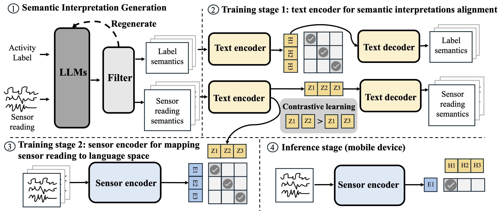

# LanHAR: Large Language Model-Guided Semantic Alignment for Human Activity Recognition

---

## System Overview
**LanHAR** introduces a new paradigm for **cross-dataset human activity recognition** powered by **large language model (LLM)-driven semantic alignment**. 

LanHAR maps both sensor readings and activity labels into a **shared semantic space** through natural-language descriptions. This alignment mitigates dataset heterogeneity and enables the recognition of activities unseen during training, offering enhanced generalization across domains and sensing environments.

**Key Components**

- 🧠 Semantic interpretation — generate semantic interpretations of sensor readings and activity labels. The system features a semantic interpretation generation process with an iterative re-generation method to ensure high-quality outputs.
- ⚙️ Two-stage training framework — transfers the reasoning capabilities of LLMs into lightweight, privacy-preserving models deployable on resource-constrained edge devices.

---
## Architecture
<p align="center">
  
</p>

**LLMs for Semantic Interpretations**

- LanHAR employs large language models (LLMs) to generate semantic interpretations of sensor readings and activity labels. An iterative re-generation process is introduced to filter out low-quality or hallucinated interpretations, ensuring semantic precision and consistency across modalities.

#### Text Encoder for Semantic Alignment
- LanHAR trains a text encoder, initialized from a pre-trained language model, to encode and align the semantic interpretations generated in step (1). This alignment enables language-guided activity recognition by matching the semantic interpretation of sensor readings with the most similar semantic representation of activity labels within the shared language space.

#### Sensor Encoder for Mapping Sensor Readings to Language Space
- LanHAR further trains a sensor encoder, built upon the text encoder from step (2), to map raw sensor readings into the language space derived from semantic interpretations. This mapping bridges the gap between sensor-level signals and high-level semantic understanding.

#### Inference on Mobile Devices
- During inference, LanHAR deploys the sensor encoder on mobile or edge devices to generate sensor embeddings, which are then compared with pre-stored (or newly added) activity label embeddings. The activity is determined through similarity computation, enabling lightweight, privacy-preserving, and real-time recognition on resource-constrained devices.


---
## Usage
#### Environment Setup
Install the required dependencies:

```bash
pip install -r requirements.txt
```
#### Prompt Generation Example

This repository includes a minimal example to help you generate prompts for human activity pattern analysis from IMU sensor features.
Simply run:

```bash
python prompt_example.py
```
Then use your own API key or local model to generate responses from the prompt.

#### Train LanHAR

---
## Citation
If you find useful in your research, please cite our paper:

```bibtex
@article{yan2024language,
  title={Language-centered human activity recognition},
  author={Yan, Hua and Tan, Heng and Ding, Yi and Zhou, Pengfei and Namboodiri, Vinod and Yang, Yu},
  journal={arXiv preprint arXiv:2410.00003},
  year={2024}
}
```


